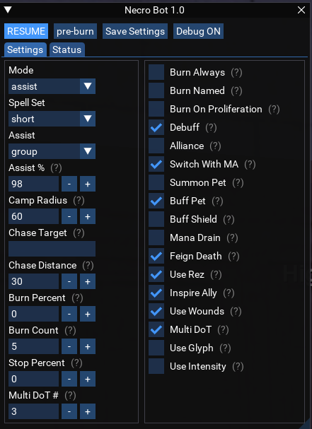

# luanecro

A Necromancer bot using Lua.

## Description
This script will automate a level 120 necro in a group or raid setting. It expects all relevant spells and abilities to be present.
The script is designed to be compatible with CWTN class plugins as its what I use where available. So, it uses the same sort of command structure for modes, pausing, resetting camp and burning.

## Installation
Place the script in your MQ Lua folder.

## Usage
Start the script with `/lua run necrobot`.

## Support
Open issues [here](https://gitlab.com/aquietone/luanecro/-/issues).

## Roadmap
Just a random project, don't really have any plans for it, beyond supporting my own needs. If you found your way here, look at [aqobot](https://gitlab.com/aquietone/aqobot) instead.
